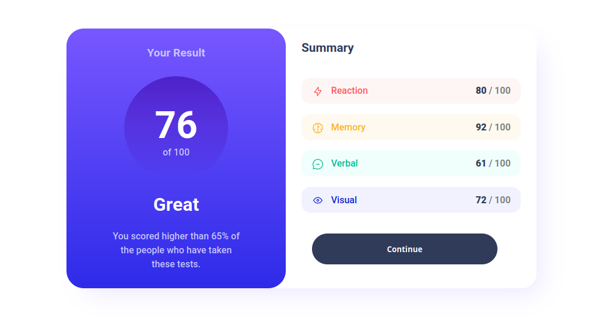
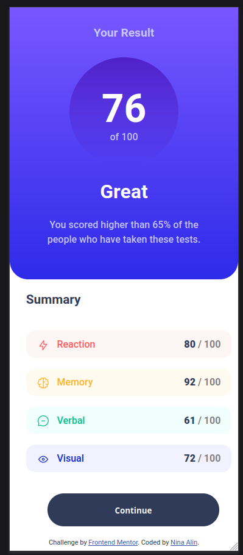

# Frontend Mentor - Results summary component solution

This is a solution to the [Results summary component challenge on Frontend Mentor](https://www.frontendmentor.io/challenges/results-summary-component-CE_K6s0maV). Frontend Mentor challenges help you improve your coding skills by building realistic projects. 

## Table of contents

- [Overview](#overview)
  - [The challenge](#the-challenge)
  - [Screenshot](#screenshot)
  - [Links](#links)
- [My process](#my-process)
  - [Built with](#built-with)
  - [What I learned](#what-i-learned)
  - [Continued development](#continued-development)
  - [Useful resources](#useful-resources)
- [Author](#author)
- [Acknowledgments](#acknowledgments)

## Overview

### The challenge

Users should be able to:

- View the optimal layout for the interface depending on their device's screen size
- See hover and focus states for all interactive elements on the page

### Screenshot




### Links

- Live Site URL: [Add live site URL here](https://your-live-site-url.com)

## My process

### Built with

- Semantic HTML5 markup
- SCSS

### What I learned

This was my first experience with SCSS. I learned how to use variables, mixins, and nesting. I also learned how to use the @media rule to make the page responsive. I also learned how to use the :hover pseudo-classe to make the page interactive. It was a great experience! 

Example of code I'm proud of:

```html
    <div class="details reaction">
        <div class="title">
        
        Reaction</div>
        <div class="score"><strong>80</strong> / 100</div>
    </div>
    <div class="details memory">
        <div class="title">
        
        Memory</div>
        <div class="score"><strong>92</strong> / 100</div>
    </div>
    <div class="details verbal">
        <div class="title">
        
        Verbal</div>
        <div class="score"><strong>61</strong> / 100</div>
    </div>
    <div class="details visual">
        <div class="title">
        
        Visual</div>
        <div class="score"><strong>72</strong> / 100</div>
    </div>
```
```scss
.details {
  display: -webkit-box;
  display: -ms-flexbox;
  display: flex;
  -webkit-box-pack: justify;
  -ms-flex-pack: justify;
  justify-content: space-between;
  -webkit-box-align: center;
  -ms-flex-align: center;
  align-items: center;
  border-radius: 15px;
  padding: 0 2vh;
  font-weight: bases.$font-weight-normal;
  color: gray;
  height: 5vh;
  strong {
    color: bases.$neutral-dark-gray-blue;
  }
}
```

### Continued development

I would love to improve my SCSS skills. I would also like to learn more about the @media rule and how to make my page more responsive. Next time, I'll try to fetch the data from a fake API instead of hardcoding it.

### Useful resources

- [SASS Documentation](https://sass-lang.com/guide) - The documentation from SASS was very helpful. It helped me understand how to use variables, mixins, and nesting.
- [mdn web docs](https://developer.mozilla.org/en-US/docs/Web/CSS) - Mozilla has a great documentation for CSS. It helped me understand how to use various properties.

## Author

- Gitlab - [ninaalin](https://www.your-site.com)
- Frontend Mentor - [@nina-alin](https://www.frontendmentor.io/profile/nina-alin)
- Twitter - [@karmirariel](https://www.twitter.com/karmirariel)

## Acknowledgments

Thank you to Frontend Mentor for this challenge. It was a great experience!
